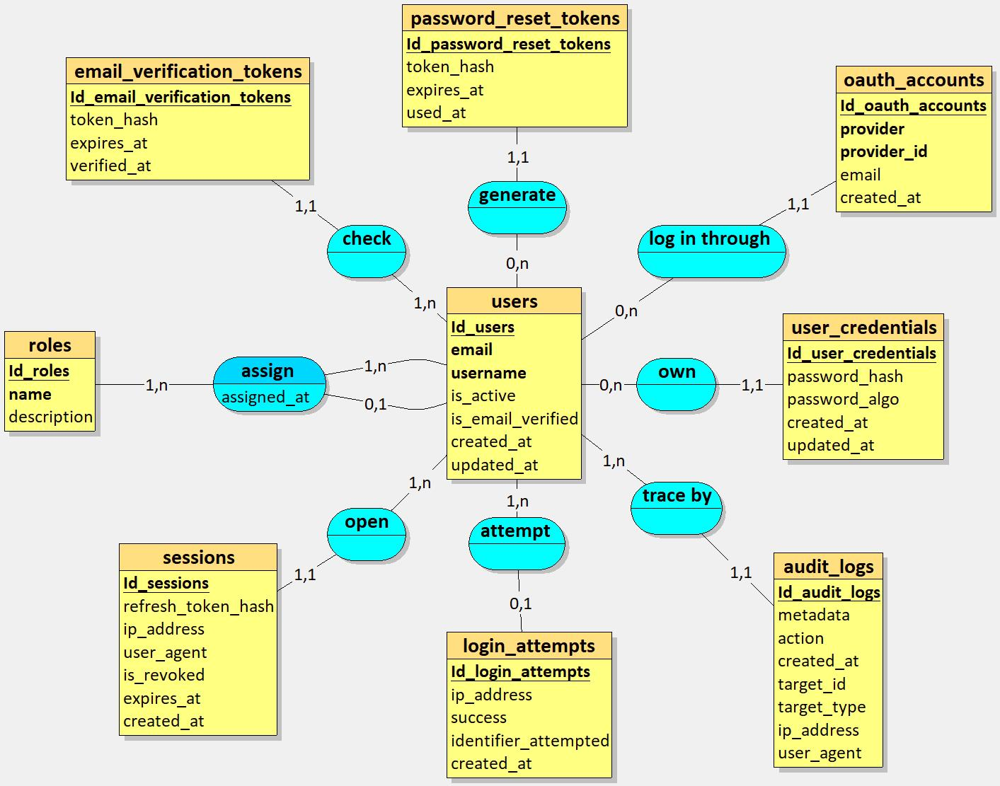
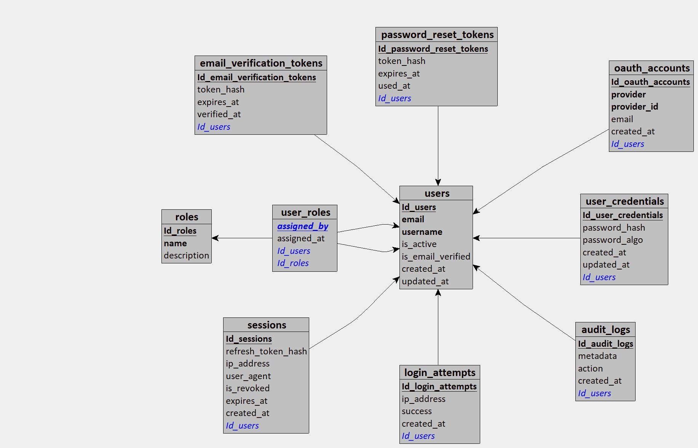

# Database Design – Merise Methodology

## Summary
1. [Management Rules](#management-rules)
2. [Data Dictionary](#dictionary-data)
3. [MCD](#mcd)
4. [MLD](#mld)
5. [MPD](#mpd)

## Management Rules

- A user must have a unique email address.
- A user may authenticate using local credentials or OAuth providers.
- A user may have multiple roles.
- A role can be assigned automatically or by an administrator.
- A user may have multiple active sessions.
- A session can be revoked at any time.
- Password reset tokens are single-use and time-limited.
- Email verification tokens are single-use and time-limited.
- A user account may be inactive.
- All sensitive actions are logged in audit logs.


## Data Dictionary

### 1. users
| Field Name        | Type         | Constraints                 | Description                   |
| ----------------- | ------------ | --------------------------- | ----------------------------- |
| id_user           | UUID         | PK, generated automatically | Unique user identifier        |
| email             | varchar(100) | unique, not null            | User email address            |
| username          | varchar(100) | unique, not null            | Username                      |
| is_active         | boolean      | default true                | Whether the account is active |
| is_email_verified | boolean      | default false               | Whether the email is verified |
| created_at        | datetime     | not null                    | Account creation date         |
| updated_at        | datetime     | null                        | Last update date              |


### 2. user_credentials
| Field Name         | Type     | Constraints                 | Description               |
| ------------------ | -------- | --------------------------- | ------------------------- |
| id_user_credential | UUID     | PK, generated automatically | Credentials identifier    |
| password_hash      | text     | not null                    | Hashed password           |
| password_algo      | text     | not null                    | Hashing algorithm(argon2) |
| created_at         | datetime | not null                    | Creation date             |
| updated_at         | datetime | null                        | Last update date          |
| id_user            | UUID     | FK → users(id_user)         | Related user              |

### 3. roles
| Field Name  | Type        | Constraints                 | Description      |
| ----------- | ----------- | --------------------------- | ---------------- |
| id_role     | UUID        | PK, generated automatically | Role identifier  |
| name        | varchar(50) | unique, not null            | Role name        |
| description | text        | null                        | Role description |

### 4. sessions
| Field Name         | Type     | Constraints                 | Description                    |
| ------------------ | -------- | --------------------------- | ------------------------------ |
| id_session         | UUID     | PK, generated automatically | Session identifier             |
| refresh_token_hash | text     | not null                    | Hashed refresh token           |
| ip_address         | text     | null                        | Client IP address              |
| user_agent         | text     | null                        | Client user agent              |
| is_revoked         | boolean  | default false               | Whether the session is revoked |
| expires_at         | datetime | not null                    | Expiration date                |
| created_at         | datetime | not null                    | Session creation date          |
| id_user            | UUID     | FK → users(id_user)         | Related user                   |

### 5. password_reset_tokens
| Field Name              | Type     | Constraints                 | Description                     |
| ----------------------- | -------- | --------------------------- | ------------------------------- |
| id_password_reset_token | UUID     | PK, generated automatically | Password reset token identifier |
| token_hash              | text     | not null                    | Hashed reset token              |
| expires_at              | datetime | not null                    | Token expiration date           |
| used_at                 | datetime | null                        | Token usage date                |
| id_user                 | UUID     | FK → users(id_user)         | Related user                    |

Token is stored hashed for security reasons.

### 6. email_verification_tokens
| Field Name                  | Type     | Constraints                 | Description                         |
| --------------------------- | -------- | --------------------------- | ----------------------------------- |
| id_email_verification_token | UUID     | PK, generated automatically | Email verification token identifier |
| token_hash                  | text     | not null                    | Hashed verification token           |
| expires_at                  | datetime | not null                    | Token expiration date               |
| verified_at                 | datetime | null                        | Email verification date             |
| id_user                     | UUID     | FK → users(id_user)         | Related user                        |

Token is stored hashed for security reasons.

### 7. login_attempts
| Field Name       | Type     | Constraints                 | Description              |
| ---------------- | -------- | --------------------------- | ------------------------ |
| id_login_attempt | UUID     | PK, generated automatically | Login attempt identifier |
| ip_address       | text     | not null                    | Client IP address        |
| success          | boolean  | not null                    | Login success or failure |
| created_at       | datetime | not null                    | Attempt date             |
| id_user          | UUID     | FK → users(id_user)         | Related user             |

### 8. oauth_accounts
| Field Name       | Type                       | Constraints                 | Description                           |
| ---------------- | -------------------------- | --------------------------- | ------------------------------------- |
| id_oauth_account | UUID                       | PK, generated automatically | OAuth account identifier              |
| provider         | enum (oauth_provider_type) | not null                    | OAuth provider (google, github, etc.) |
| provider_id      | varchar(50)                | not null                    | Provider user identifier              |
| email            | varchar(50)                | not null                    | OAuth email                           |
| created_at       | datetime                   | not null                    | Account creation date                 |
| id_user          | UUID                       | FK → users(id_user)         | Related user                          |

### 9. audit_logs
| Field Name   | Type     | Constraints                 | Description          |
| ------------ | -------- | --------------------------- | -------------------- |
| id_audit_log | UUID     | PK, generated automatically | Audit log identifier |
| metadata     | jsonb    | null                        | Additional metadata  |
| action       | text     | not null                    | Performed action     |
| created_at   | datetime | not null                    | Action date          |
| id_user      | UUID     | FK → users(id_user)         | Related user         |

### 10. user_roles (Association table)
| Field Name  | Type     | Constraints             | Description      |
| ----------- | -------- | ----------------------- | ---------------- |
| id_user     | UUID     | PK, FK → users(id_user) | User identifier  |
| id_role     | UUID     | PK, FK → roles(id_role) | Role identifier  |
| assigned_by | UUID     | FK → users(id_user)     | Assigned by user |
| assigned_at | datetime | not null                | Assignment date  |


## MCD (Modèle Conceptuel de Données)
The MCD represents entities and their relationships with cardinalities.



## MLD (Modèle Logique de Données)
The MLD translates the MCD into relational tables, respecting constraints and relationships.




## MPD (Modèle Physique de Données)
MPD is a specific implementation for PostgreSQL, including data types, constraints and indexes.

1. **users** = (Id_user UUID , email VARCHAR(100), username VARCHAR(100), is_active boolean, is_email_verified boolean, created_at DATETIME, updated_at DATETIME);
2. **user_credentials** = (Id_user_credentials UUID , password_hash TEXT, password_algo TEXT, created_at DATETIME, updated_at DATETIME, #Id_user);
3. **roles** = (Id_role UUID , name VARCHAR(50), description TEXT);
4. **sessions** = (Id_session UUID , refresh_token_hash TEXT, ip_address TEXT, user_agent TEXT, is_revoked boolean, expires_at DATETIME, created_at DATETIME, #Id_user);
5. **password_reset_tokens**  = (Id_password_reset_token UUID , token_hash TEXT, expires_at DATETIME, used_at DATETIME, #Id_user);
6. **email_verification_tokens**  = (Id_email_verification_token UUID , token_hash TEXT, expires_at DATETIME, verified_at DATETIME, #Id_user);
7. **login_attempts**  = (Id_login_attempt UUID , ip_address TEXT, success boolean, created_at DATETIME, #Id_user);
8. **oauth_accounts**  = (Id_oauth_account UUID , provider oauth_provider_type, provider_id VARCHAR(50), email VARCHAR(50), created_at DATETIME, #Id_user);
9. **audit_logs**  = (Id_audit_log UUID , metadata jsonb, action TEXT, created_at DATETIME, #Id_user);
10. **user_roles** = (#Id_user, #Id_role, assigned_by UUID, assigned_at DATETIME); -- PRIMARY KEY (id_user, id_role)

### Tables and Constraints
- Primary keys use `UUID` generated by `gen_random_uuid()` for better security.
- Foreign keys include constraints `ON DELETE` and `ON UPDATE` (RESTRICT or CASCADE as applicable).
- Sensitive fields (password) use `TEXT` to store hashes.
- Enumerations are implemented with PostgreSQL type `ENUM`.

## Database Constraints & SQL Notes

```sql
-- OAuth provider enumeration
CREATE TYPE oauth_provider_type AS ENUM ('GOOGLE', 'GITHUB');

-- Unique OAuth account per provider
CREATE UNIQUE INDEX ux_oauth_provider
ON oauth_accounts (provider, provider_id);

-- One active credential per user
CREATE UNIQUE INDEX ux_user_credentials_user
ON user_credentials (id_user);

-- Index for token lookup
CREATE INDEX ix_password_reset_token
ON password_reset_tokens (token_hash);

-- Fast lookup by email
CREATE UNIQUE INDEX ux_users_email ON users(email);

-- Fast lookup by username
CREATE UNIQUE INDEX ux_users_username ON users(username);

-- Refresh token lookup
CREATE UNIQUE INDEX ux_sessions_refresh_token
ON sessions(refresh_token_hash);

-- Active sessions per user
CREATE INDEX ix_sessions_user_active
ON sessions(id_user)
WHERE is_revoked = false;


```